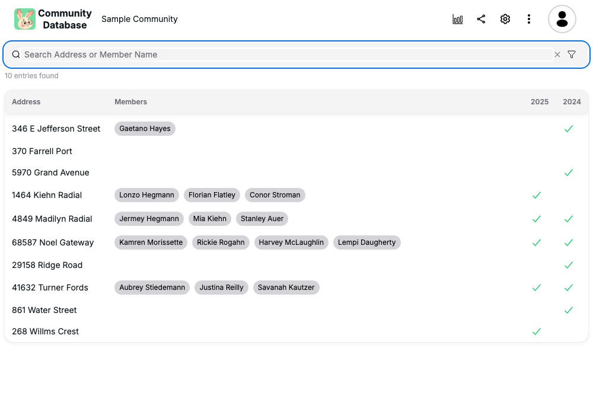
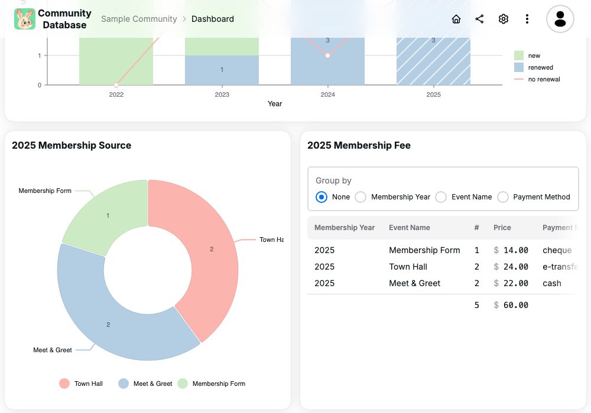

# community-db


**A database for community. Keeping record of household within small community, events, memberships, etc..**

[](https://community-db.com)
[](LICENSE.md)

## Screenshots

<table>
  <tbody>
    <tr>
      <td>
        <picture>
          <source media="(prefers-color-scheme: dark)" srcset="src/app/view/landing/feature-overview-image-list/screenshots/dark/property-list.png" />
          
        </picture>
      </td>
      <td>
        <picture>
          <source media="(prefers-color-scheme: dark)" srcset="src/app/view/landing/feature-overview-image-list/screenshots/dark/dashboard.png" />
          
        </picture>
      </td>
    </tr>
    <tr>
      <td>Easily search membership information within community</td>
      <td>Visualize membership information</td>
    </tr>
  </tbody>
</table>

## 🛠️ Tech Stack

| **Category**       | **Technology**                                |
| ------------------ | --------------------------------------------- |
| **Framework**      | [Next.js](https://nextjs.org/)                |
| **Frontend**       | [React](https://react.dev/)                   |
| **Language**       | [TypeScript](https://www.typescriptlang.org/) |
| **Database**       | [MongoDB](https://www.mongodb.com/)           |
| **Authentication** | [Better-Auth](https://www.better-auth.com/)   |
| **Upload storage** | [uploadthing](https://uploadthing.com/)       |
| **Email handling** | [nodemailer](https://nodemailer.com/)         |
| **UI Component**   | [HeroUI](https://www.heroui.com/)             |
| **CSS Processor**  | [Tailwind CSS](https://tailwindcss.com/)      |
| **Animation**      | [Motion](https://motion.dev/)                 |
| **Icons**          | [Iconify](https://iconify.design/)            |

## 💻 **For Developers**

```bash
# Create a .env.local file
# Replace the '...' value with appropriate values
cp .env .env.local

# Run the development server
yarn dev
```

Open [http://localhost:3000](http://localhost:3000) with your browser to see the result.

This project uses [`next/font`](https://nextjs.org/docs/basic-features/font-optimization) to automatically optimize and load Inter, a custom Google Font.

To start development server in HTTPS mode and HTTP/2 mode, refer to `nginx/README.md`. This project uses SSE (Server Sent Events) to perform graphQL subscription, using HTTP/1 would work as well, but with some restrictions.

### Setting up mongodb

The mongo DB must be configured with replication set:

- stop mongo service: `brew services stop mongodb-community`

- update mongo config `$(brew --prefix)/etc/mongod.conf` file with replication props:

  ```sh
  systemLog:
    destination: file
    # Change /opt/homebrew/var to /usr/local/var (if on intel)
    path: /opt/homebrew/var/log/mongodb/mongo.log
    logAppend: true
  storage:
    # Change /opt/homebrew/var to /usr/local/var (if on intel)
    dbPath: /opt/homebrew/var/mongodb
  net:
    bindIp: 127.0.0.1
  replication:
    replSetName: "rs0"
  ```

- start mongo service: `brew services start mongodb-community`

- while mongod is running, run `mongosh`, then:

  ```sh
  rs.initiate({_id: 'rs0', members: [{_id: 0, host: '127.0.0.1:27017'}]});
  ```

- if you need to apply new configuration, then:

  ```sh
  rs.reconfig({_id: 'rs0', members: [{_id: 0, host: '127.0.0.1:27017'}]}, {force:true});
  ```

### Updating mongo schema

Whenever mongo schema `prisma/schema.prisma` is modified, you will need to run:

```sh
yarn update-prisma-db
```

### Updating landing page screenshots

The screenshots are generated by running the playwright test `tests/screenshot/landing.ts`. The database is prepared by restoring from `__fixtures__/db-screenshot.xlsx`. You can optionally reseed the database by uncommentting the line:

```js
await mongodbSeedRandom(10);
```

This test is excluded from e2e test run, so it must be manually run to recreate the screenshots.

```sh
# On one terminal, start the dev server
yarn dev:playwright
# On another terminal, run the screenshot tests
yarn pw:screenshot
```

### Updating App logo

Many app related logo files are generated via this command:

```sh
yarn gen-favicon
```

Note: The Google OAuth consent screen also make use of the app logo, and should be updated accordingly if this is changed.

### Updating Email content

Emails are sent through `nodemailer`, and the content is defined in `src/email/**.ts`. The email content is generated using [react-email](https://react.email/).

To run the email viewer locally:

```sh
yarn email-dev
```

### Prerequiste for deploying to Microsoft Azure

In [Azure Portal](https://portal.azure.com):

- create Resource Group `<group-name>`
- create Container Registry `<registry-name>`
- create App Service `<app-name>`

Install Azure CLI:

```shell
brew update
brew install azure-cli

# Sign in to Azure
az login
```

## Building docker image

### Build new docker image to Azure container registry

```shell
# clone git repository
# On windows box, it's important to keep the CRLF of the repository file
# because files like `docker/entrypoint.sh` need to have LF line ending (not CRLF)
git clone git@github.com:luumitech/community-db.git --config core.autocrlf=input

# To push a new image and tag it as `dev``
# Tagging an image with 'dev' will trigger a webhook to deploy the image into dev slot
./script/azure/build-image.sh --tag=dev
```

### Build new docker image to Docker container registry

```shell
# clone git repository
# On windows box, it's important to keep the CRLF of the repository file
# because files like `docker/entrypoint.sh` need to have LF line ending (not CRLF)
git clone git@github.com:luumitech/community-db.git --config core.autocrlf=input

# To push a new image and tag it as `main``
# Tagging an image with 'main' will trigger a webhook to deploy the image into main slot
./script/docker-hub/build-image.sh --tag=main
```
